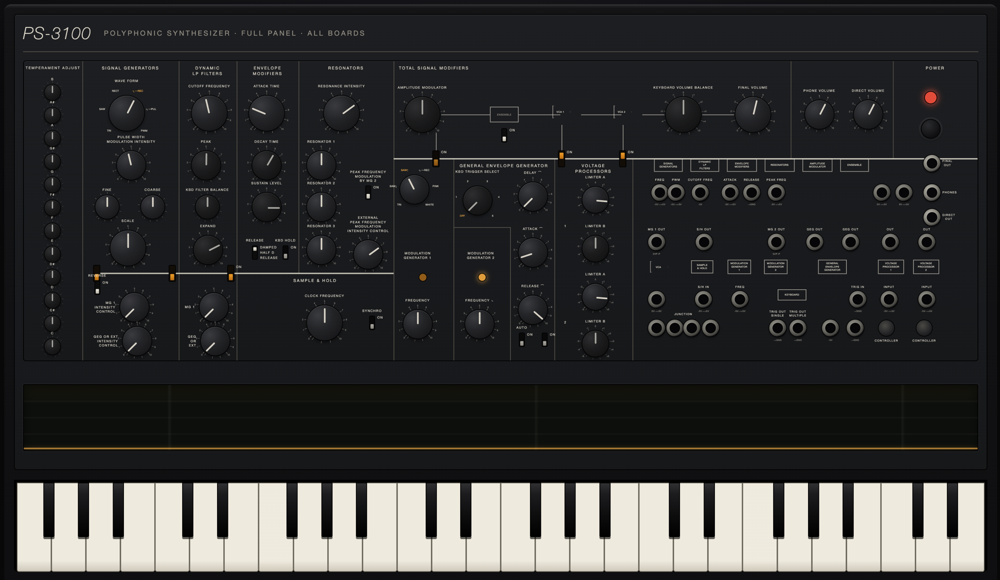

# ps3100-sim

[](https://blog.ᗲ.com/ps3100-sim/panel/)

**[Play the full panel in your browser](https://blog.ᗲ.com/ps3100-sim/panel/)**

An open simulation of the PS-3100 polyphonic synthesizer: each board captured as
a SPICE netlist, turned into a real-time [Faust](https://faust.grame.fr) DSP
model, and checked against the netlist so the fast model can't drift from the
circuit. Builds as a VST3/AU plugin and a set of playable in-browser bench pages.

- **Netlists** (`netlists/*.cir`) - each board transcribed from the service-manual
  schematics, run in ngspice.
- **Theory** (`analysis/`) - sympy transfer functions and CV laws, checked against SPICE.
- **DSP** (`dsp/*.dsp`) - Faust models fit to the SPICE response, each refereed by
  ngspice (the resonator holds ±0.5 dB at band centers, ±2 dB on the skirts).
- **Plugin** (`plugin/`) - a JUCE VST3/AU/Standalone, DSP regenerated from Faust at build.
- **Web** (`web/`) - the Faust models as WebAssembly, one playable panel per board
  plus a composed 48-voice instrument.

## What's modeled

All the sound and modulation boards, composed into a 48-voice instrument:

- **Resonators** (KLM-62) - triple-vactrol band-pass core and CV drive.
- **Signal generators** (KLM-64) - per-note tuning and the waveform staircase.
- **Gate + KORG35 low-pass** (KLM-69).
- **Ensemble / BBD chorus** (KLM-76).
- **MG1 + noise** and **MOD-VCA + MG2** (KLM-63).
- **GEG envelope, sample & hold, VCA, voltage processors, keyboard trigger** (KLM-76).
- **Balance mixer + AM** (KLM-62D) and the CV utility boards.

Not modeled: the KLM-77 / KLM-80 output and keyboard-scan boards and the power supplies.

## Quickstart

```bash
brew install ngspice faust        # Linux: apt-get install ngspice faust
uv sync
uv run pytest -v                  # full SPICE / theory / DSP validation chain
cmake -B plugin/build plugin && cmake --build plugin/build --config Release
python3 -m http.server -d web     # browser benches (see web/README.md)
```

## Layout

- `netlists/` - SPICE netlists and device models.
- `analysis/` - ngspice runners and sympy derivations.
- `dsp/` - Faust models, one per board plus the composed instrument.
- `tests/` - SPICE-vs-theory and DSP-vs-SPICE tests.
- `plugin/` - JUCE plugin.
- `web/` - WebAssembly bench pages (see `web/README.md`).

## License

MIT - see [LICENSE](LICENSE). An independent simulation project, not affiliated
with or endorsed by the original manufacturer; "PS-3100" and "PS-3300" are
trademarks of their respective owner.
